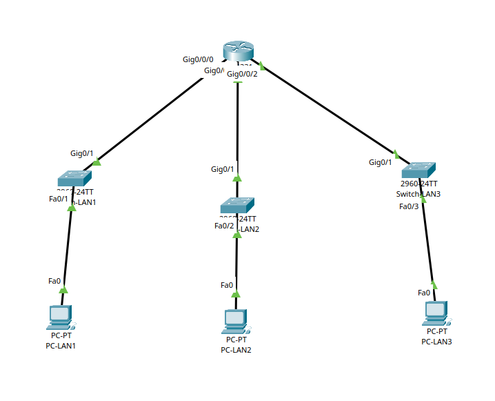

# <p> Roteamento IPV4 usando Cisco Packet Tracer </p>

<p>
  
</p>


## <p> Sobre o Projeto </p>
Criação de uma pequena infraestrutura LAN no packet Tracer utilizando 3 PCs (LAN-1 , LAN-2 , LAN-3) , 1 roteador (Cisco ISR 4331) , \
3 switches (Cisco 2960-24TT).

## <p> Topologia da Rede </p>

                     +---------------------------+
                     |         RT-[XY]           |
                     |       Cisco 4331          |
                     +---------------------------+
                       /           |           \
               G0/0/0 /     G0/0/1 |            \ G0/0/2
                     /             |             \
              G0/1  /         G0/1 |         G0/1 \
      +---------------+   +---------------+   +---------------+
      |   SW-[XY]-1   |   |   SW-[XY]-2   |   |   SW-[XY]-3   |
      +---------------+   +---------------+   +---------------+
        /     |     \       /     |     \       /     |     \
      Fa0/1 Fa0/2 Fa0/3   Fa0/1 Fa0/2 Fa0/3   Fa0/1 Fa0/2 Fa0/3
       /      |      \     /      |      \     /      |      \
     PC-1   PC-2   PC-3  PC-4   PC-5   PC-6  PC-7   PC-8   PC-9
     |--- LAN-1 ---|     |--- LAN-2 ---|     |--- LAN-3 ---|

## Esquema de Endereçamento (Baseado em Matrícula)

Nota: Substitua XY pelos dois últimos dígitos da sua matrícula e Z = XY + 1.

## Script de Configuração dos Ativos CLI

### Roteador (RT-[XY])
```
enable
configure terminal
hostname RT-XY

! Configuração da LAN-1
interface gigabitEthernet 0/0/0
 description LAN-1
 ip address 172.16.XY.1 255.255.255.0
 no shutdown
 exit

! Configuração da LAN-2
interface gigabitEthernet 0/0/1
 description LAN-2
 ip address 172.16.Z.1 255.255.255.128
 no shutdown
 exit

! Configuração da LAN-3
interface gigabitEthernet 0/0/2
 description LAN-3
 ip address 172.16.Z.129 255.255.255.128
 no shutdown
 exit

end
copy running-config startup-config
```
### Switch LAN-1 (SW-[XY]-1)
```
enable
configure terminal
hostname SW-XY-1

interface gigabitEthernet 0/1
 description UPLINK-RT-XY-LAN-1
 exit

interface fastEthernet 0/1
 description PC-1
 exit

interface fastEthernet 0/2
 description PC-2
 exit

interface fastEthernet 0/3
 description PC-3
 exit

end
copy running-config startup-config
```
(Copie o padrão acima adaptando as descrições para os switches SW-XY-2 e SW-XY-3).
